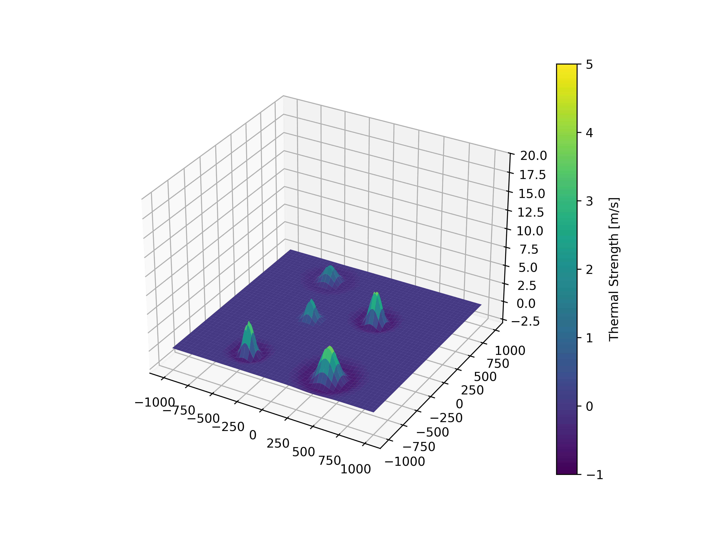

# Thermal Modelling
Repository containing Thermal models used for energy harvesting and exploitation in glider flights. These implementations are very rudimentary and basic and not optimized for performance or applicability and should only serve as a starting point for further analysis and investigations.

For an example on how to use the thermal models see [TODO]

## Implemented

### Gaussian Thermals (2D)
- modelled as simple Gaussian Distribution

### Gedeon Thermals (2D)
- modelled as Gaussian Distribution with a downdraft area around thermal center

### AllenGedeonThermal (3D)
- combination of Thermal Model with variying Radius and Strength based on relative height

## Not (yet) Implemented
### True Allen Thermal (3D)
- as described in paper
### Bubble Thermal (3D)
- as described in 
### Ridge Lift
- not really thermals but could be interesting for testing

## Structure
### BaseThermal
The Thermal.py baseclase provides the interfaces for the implementation of the different thermals.

### Thermal Mixture
- Mixture of different types of thermals

### Temporal Evolution
Thermals are known to not always be stationary. The thermal mixture can change its centers over time.

## Known Problems

# References
[1] J. Gedeon, “DYNAMIC ANALYSIS OF DOLPHIN-STYLE THERMAL CROSS-COUNTRY FLIGHT: Part II,” Technical Soaring, vol. 3, no. 3, Art. no. 3, 1974.

[2] M. Allen, “Updraft Model for Development of Autonomous Soaring Uninhabited Air Vehicles,” in 44th AIAA Aerospace Sciences Meeting and Exhibit, Reno, Nevada: American Institute of Aeronautics and Astronautics, Jan. 2006. doi: 10.2514/6.2006-1510.

[3] R. Bencatel, J. Tasso de Sousa, and A. Girard, “Atmospheric flow field models applicable for aircraft endurance extension,” Progress in Aerospace Sciences, vol. 61, pp. 1–25, Aug. 2013, doi: 10.1016/j.paerosci.2013.03.001.